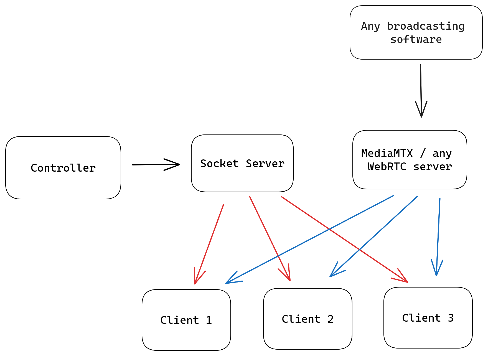

# Video Broadcaster

This is a multi-program website which allows you to broadcast your screen to multiple remote computer. It is made up of three programs:

- [Video Broadcast Socket Server](../socketserver)
- [Video Broadcast Controller](../controller)
- [Video Broadcast Client](../client)

The code isn't intended to "just work", there are specific settings for my personal usecase of this. However, feel free to use it as a starting point.

In the background, [MediaMTX](https://github.com/bluenviron/mediamtx) is used to receive a video stream and distribute it to multiple clients.

## Structure

<picture>
  <source srcset="./assets/structure_dark.png" media="(prefers-color-scheme: dark)">
  
</picture>


## Installation
### Socket Server
The socket server is a simple NodeJS server which acts as a management interface between the controller and the client. It is used to store the list of clients and their connection details.
```bash
cd socketserver
npm install
cp .env.sample .env # edit .env file
npm start
```

### Controller
The controller is a Next.js website which allows you to view and control the remote computers connected to your broadcast.

:warning: The controller uses OpenID Connect to authenticate users. You will need to setup your own OpenID Connect provider and configure the controller to use it. Alternatively, you can remove all references to NextAuth.js to disable authentication.

```bash
cd controller
npm install
cp .env.sample .env # edit .env file
npm run dev
```

### Client
The client is a simple website which connects to the MediaMTX stream via WebRTC to display the video. In the background, it communicates with the socket server to send it information about the client.

For installation, just copy the contents of the `client` folder to your webserver.


## License
This project is licensed under the MIT License - see the [LICENSE](LICENSE) file for details